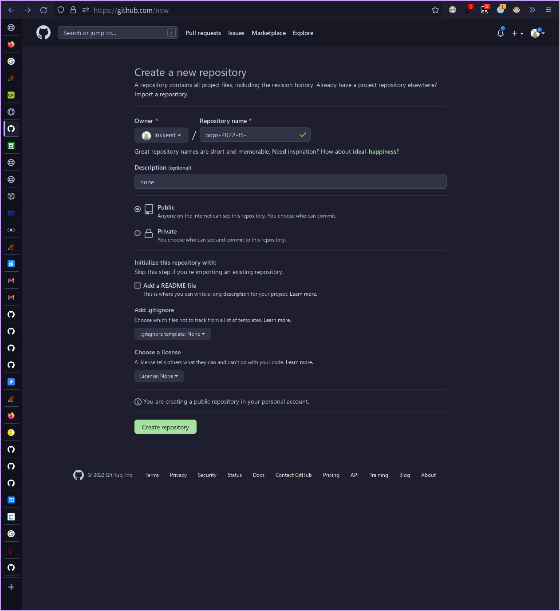

# oops T5

QQ: 1593510417



```bash
$ pwd
# /home/lnk/tmper/codes/oops2022/t5
$ git init
# hint: Using 'master' as the name for the initial branch. This default branch name
# hint: is subject to change. To configure the initial branch name to use in all
# hint: of your new repositories, which will suppress this warning, call:
# hint:
# hint:  git config --global init.defaultBranch <name>
# hint:
# hint: Names commonly chosen instead of 'master' are 'main', 'trunk' and
# hint: 'development'. The just-created branch can be renamed via this command:
# hint:
# hint:  git branch -m <name>
# Initialized empty Git repository in /home/lnk/tmper/codes/oops2022/t5/.git/
$ git remote add github git@github.com:lnkkerst/oops-2022-t5.git

$ nvim t5.py

$ cat t5.py
# #!/usr/bin/env python3
#
# print("Hello,oops")

$ python3 t5.py
# Hello,oops

$ git add .

$ git commit -m "feat: hello oops"
# [master (root-commit) a60dda5] feat: hello oops
#  1 file changed, 3 insertions(+)
#  create mode 100644 t5.py

$ git push -u github master
# Enumerating objects: 3, done.
# Counting objects: 100% (3/3), done.
# Writing objects: 100% (3/3), 253 bytes | 253.00 KiB/s, done.
# Total 3 (delta 0), reused 0 (delta 0), pack-reused 0
# To github.com:lnkkerst/oops-2022-t5.git
#  * [new branch]      master -> master
# branch 'master' set up to track 'github/master'.
```

Have a nice day :)
